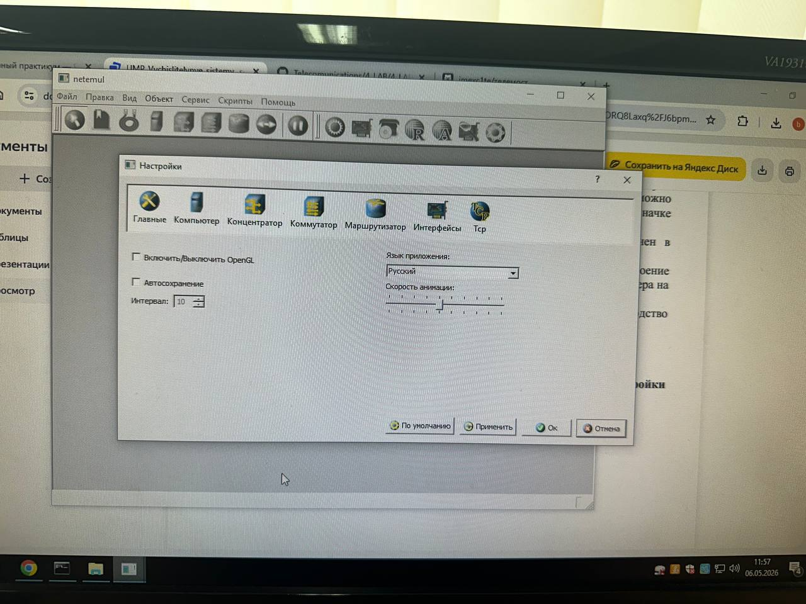
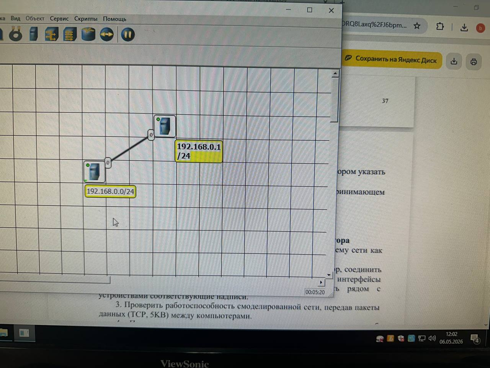
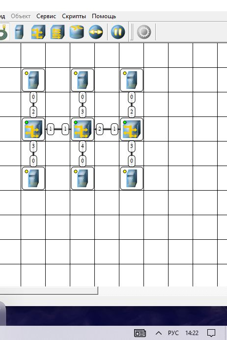

# Лабораторная работа №3
## Моделирование компьютерных сетей в NetEmul

---

## Задание 1

## Задание 2

## Задание 3

## Задание 4

## Контрольные вопросы

**Какие виды программ используются для моделирования компьютерных сетей?**  
Симуляторы (имитируют поведение сети без реального трафика, менее требовательны к ресурсам) и эмуляторы (позволяют работать с «живым» трафиком и конфигурациями реальных устройства).

**Что такое IP-адрес?**  
Уникальный цифровой идентификатор устройства в сети, например `192.168.0.1`.

**Что такое маска подсети?**  
Параметр, определяющий, какая часть IP-адреса относится к адресу сети, а какая — к адресу узла.

**Как работает концентратор?**  
Концентратор (Hub) получает сигнал на одном порту и ретранслирует его на все остальные порты, кроме порта-отправителя.

**Какие особенности обмена данными в ЛВС на основе концентраторов?**  
Разделяемая среда передачи данных, возникновение коллизий, возможность перехвата чужого трафика, плохая масштабируемость.

**Что такое localhost?**  
Стандартное доменное имя для обращения к текущему локальному компьютеру, соответствует IP-адресу `127.0.0.1` в IPv4.