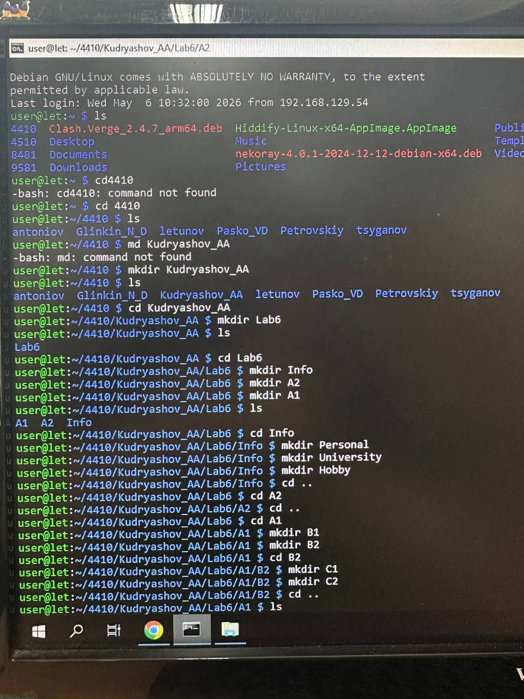
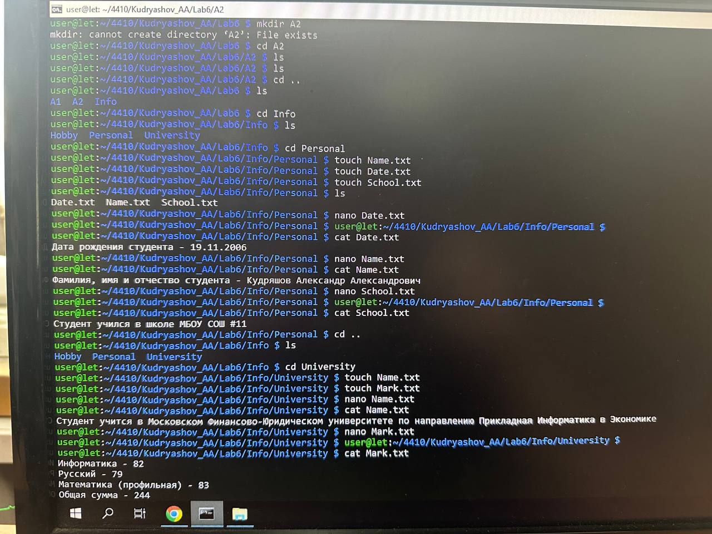
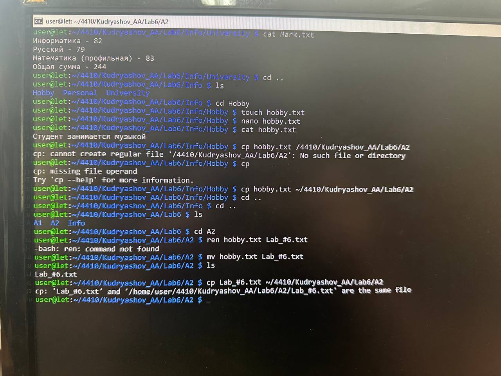
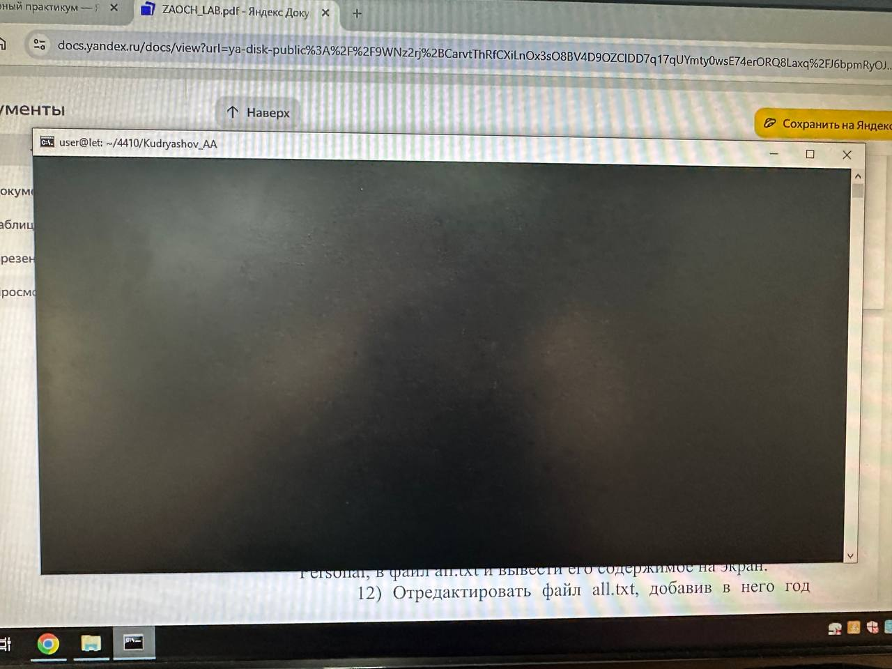
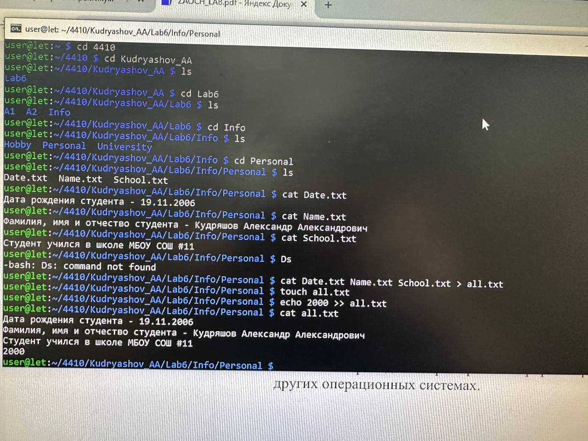

# Задание 1-2



# Задание 3-4



# Задание 5-7



# Задание 8



# Задание 9-15



# Контрольные вопросы и ответы

## 1. Что такое командная строка?
Командная строка — это текстовый интерфейс пользователя для взаимодействия с операционной системой компьютера или другого устройства через команды, вводимые с клавиатуры. Она представляет собой оболочку операционной системы, которая позволяет пользователю:
- управлять файлами, папками, процессами;
- настраивать сетевые подключения;
- выполнять программирование с использованием встроенного скриптового языка.
- После отправки команд на обработку встроенный интерпретатор переводит их в машинный код, который затем выполняется системой.

## 2. Основные команды управления файлами в командной строке Windows
- ```dir``` — отображает список файлов и каталогов в указанной директории.
- ```cd``` — меняет текущий каталог (например, cd C:\Users перейдёт в папку пользователей).
- ```md (или mkdir)``` — создаёт новую папку.
- ```rd (или rmdir)``` — удаляет пустую папку.
- ```copy``` — копирует файлы из одного места в другое.
- ```move``` — перемещает файлы или папки.
- ```del (или erase)``` — удаляет файлы (например, del file.txt удалит файл file.txt).
- ```xcopy``` — копирует файлы и директории, включая их структуру.
- ```robocopy``` — более продвинутая версия ```xcopy```, используется для надёжного копирования данных.
- ```ls``` печатает в стандартный вывод содержимое каталогов. 

## 3. Команды для вывода основной информации о системе в Windows
- ```systeminfo``` — выводит информацию о системе, включая версию Windows, параметры оборудования и установленные обновления.
- ```ver``` — отображает версию операционной системы Windows.
- ```wmic bios get serialnumber``` — получает серийный номер BIOS.
- ```winver``` — показывает версию Windows.
-```ipconfig``` — отображает конфигурацию сетевых интерфейсов системы (IP адреса, маску подсети и шлюзы).

## 4. Команды ввода/вывода файлов
- ```echo > файл```— создаёт файл и записывает в него текст (например, echo Текст > file.txt).
- ```copy con файл``` — копирует содержимое консоли в файл. Для завершения ввода нужно нажать Ctrl+Z, а затем Enter.
- ```type файл```— выводит содержимое текстового файла на экран.
- ```more файл``` — постраничный вывод содержимого большого файла.

### Перенаправление вывода:
- ```команда > файл```— перезапись файла.
- ```команда >> файл ```— добавление в конец файла.

### Перенаправление ввода:
- ```команда < файл```— читает данные из файла вместо ввода с клавиатуры.

## 5. Возможно ли полноценное управление системой, пользуясь только командной строкой? Ответ обоснуйте
Да, полноценное управление системой возможно с помощью только командной строки.
Командная строка предоставляет доступ ко всем системным процессам, файлам, сетевым настройкам, реестру и другим аспектам работы операционной системы. 
###Через неё можно:
- выполнять диагностику и восстановление системы;
- управлять дисками и разделами;
- настраивать сетевые параметры;
- запускать и завершать процессы;
- работать с пользователями и группами;
- автоматизировать задачи через скрипты;
- удалённо управлять системой.
- Однако это требует:
- глубоких знаний команд и их параметров;
- понимания работы операционной системы.

*Графический интерфейс удобнее для повседневных задач, но командная строка незаменима для автоматизации, удалённого управления и решения сложных технических задач.*

## 6. Подумайте, чем отличается командная строка Windows от командной строки MS-DOS, несмотря на их схожесть в командах.
Хотя командная строка Windows (cmd.exe) внешне похожа на MS-DOS и использует многие те же команды, между ними есть важные отличия:

- **Природа программы:** MS-DOS была полноценной операционной системой, а командная строка Windows — это всего лишь приложение (cmd.exe), работающее внутри Windows.
- **Разрядность:** Командный процессор MS-DOS (COMMAND.COM) был 16-битным, тогда как cmd.exe — 32-битное или 64-битное приложение.
- **Поддержка длинных имён:** В командной строке Windows поддерживаются длинные имена файлов и папок (например, `МойДокумент.txt`), в MS-DOS — только формат 8.3 (`МОЙДОК~1.TXT`).
- **Эмуляция:** Командная строка Windows эмулирует среду DOS для обратной совместимости, но многие старые DOS-программы, напрямую обращающиеся к оборудованию, не могут работать (особенно в 64-битных версиях Windows).
- **Сценарии:** Синтаксис пакетных файлов в cmd.exe более развит, чем в MS-DOS.

*Таким образом, MS-DOS — это историческая операционная система, а командная строка Windows — её эмуляция для выполнения современных задач.*

## 7. Приведите примеры интерпретаторов команд в других операционных системах.
Интерпретатор команд (командная оболочка) — это программа, которая принимает команды пользователя и передает их операционной системе.

Примеры интерпретаторов:
**Linux**
- По умолчанию: `bash` (Bourne again shell)
- Другие: `sh`, `zsh`, `fish`, `csh`, `ksh`

**macOS**
- По умолчанию: `zsh` (в новых версиях)
- Другие: `bash`, `sh`, `fish`

**Unix (общие)**
- По умолчанию: `sh`
- Другие: `bash`, `ksh`, `csh`, `tcsh`

**Windows**
- По умолчанию: `cmd.exe`
- Другие: `PowerShell`, `bash` (через WSL)

*Также существуют кроссплатформенные оболочки, такие как PowerShell (работает на Windows, Linux, macOS) и различные реализации Unix-подобных оболочек в Windows через WSL (Windows Subsystem for Linux).*